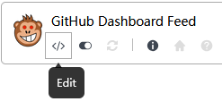
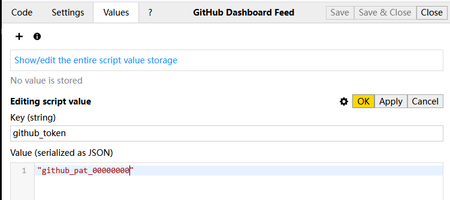

# github-dashboard-feed

## Why

- https://github.blog/changelog/2024-11-08-upcoming-changes-to-data-retention-for-events-api-atom-feed-timeline-and-dashboard-feed-features/
- https://github.com/orgs/community/discussions/137289
- https://github.com/orgs/community/discussions/173638

## Usage

1. Create a personal access token, select **All repositories**, no permissions required: [https://github.com/settings/personal-access-tokens/new](https://github.com/settings/personal-access-tokens/new)

2. After installing the userscript in Tampermonkey, choose **Edit**:

  

Go to **Values**, click the plus sign, and add `github_token` along with the token wrapped in double quotes, use the `OK` not the `Apply` button:

  

3. Refresh the GitHub!

## TODO

- [ ] pagination

## How

- https://docs.github.com/en/rest/using-the-rest-api/github-event-types
- https://docs.github.com/en/rest/activity/events#list-events-received-by-the-authenticated-user
- https://docs.github.com/en/rest/using-the-rest-api/using-pagination-in-the-rest-api
