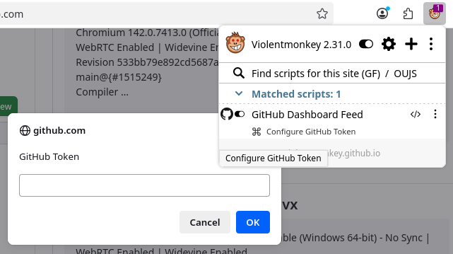
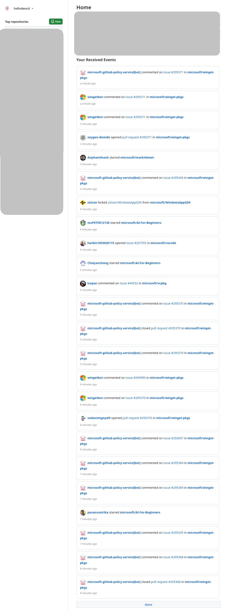

# github-dashboard-feed

One day in 2023, I noticed that GitHub had suddenly replaced the feed with **For You**. Maybe GitHub had researched and found that many people like its recommendation system, but I really disliked its “randomness.” Fortunately, I wasn’t alone—enough people disliked it[^1][^2] that someone created [old-github-feed](https://github.com/Gerrit0/old-github-feed).

Some time ago, that project stopped working[^3][^4][^5] because GitHub replaced the previously preserved [old feed](https://github.com/dashboard-feed) with **For You** as well[^6][^7].

I had to look for a new solution. Luckily, there’s still a [GitHub API](https://docs.github.com/en/rest/activity/events#list-events-received-by-the-authenticated-user) that can provide similar functionality. After a bit of relaxed vibe coding (thanks to Copilot and GPT), I built an initial version. It’s still very early, but already good enough for me to use.

## Warnings

- **Tested only in Firefox >=143.0 and ViolentMonkey >=2.31.0.** I’m not sure if it will run properly in other environments, but issues and PRs are welcome!
- ViolentMonkey currently lacks a mechanism similar to [Subresource Integrity](https://developer.mozilla.org/en-US/docs/Web/Security/Subresource_Integrity), so there’s no way to mitigate the supply chain attack risk from CDN services used in `@require`. We’ll have to wait for an upstream solution[^8].
- By default, the body is not rendered. When enabled, it uses `DOMPurify` to sanitize the generated HTML, but there are still risks, please refer to [DOMPurify's Security Goals & Threat Model](https://github.com/cure53/DOMPurify/wiki/Security-Goals-&-Threat-Model).

## Usage

1. Create a personal access token, select **All repositories**, no permissions required: [https://github.com/settings/personal-access-tokens/new](https://github.com/settings/personal-access-tokens/new)

2. After installing the userscript, refresh the GitHub. Then, in the Violentmonkey toolbar, you’ll see the **Configure GitHub Token** menu — click it to configure.

  

## Screenshot

> Pretend I’m microsoft :)

  

## Ref

- https://docs.github.com/en/rest/using-the-rest-api/github-event-types
- https://docs.github.com/en/rest/activity/events#list-events-received-by-the-authenticated-user
- https://docs.github.com/en/rest/using-the-rest-api/using-pagination-in-the-rest-api

[^1]: https://news.ycombinator.com/item?id=37413126
[^2]: https://github.com/orgs/community/discussions/66188
[^3]: https://github.com/orgs/community/discussions/173638
[^4]: https://github.com/Gerrit0/old-github-feed/issues/20
[^5]: https://github.com/wangrongding/github-old-feed/issues/15
[^6]: https://github.blog/changelog/2024-11-08-upcoming-changes-to-data-retention-for-events-api-atom-feed-timeline-and-dashboard-feed-features/
[^7]: https://github.com/orgs/community/discussions/137289
[^8]: https://github.com/violentmonkey/violentmonkey/issues/1558
